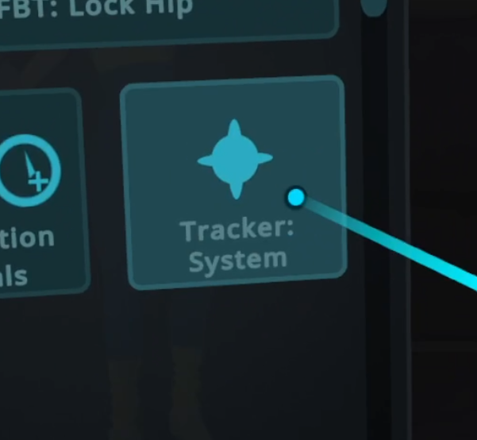

# OSC 追踪器

VRChat 现在支持通过 OSC 接收追踪器数据，以便与我们现有的校准全身 IK 系统配合使用。

请注意：这是一项高级功能！它不是即插即用的。您必须创建自己的程序，使用 OSC 将这些数据传输到 VRChat。

追踪器的硬件制造商可能会提供一个应用程序，为您发送这些数据。您也可以使用社区创建的程序来利用您的全身跟踪设置。

## OSC 地址

```
/tracking/trackers/1/position
/tracking/trackers/1/rotation
/tracking/trackers/2/position
/tracking/trackers/2/rotation
/tracking/trackers/3/position
/tracking/trackers/3/rotation
/tracking/trackers/4/position
/tracking/trackers/4/rotation
/tracking/trackers/5/position
/tracking/trackers/5/rotation
/tracking/trackers/6/position
/tracking/trackers/6/rotation
/tracking/trackers/7/position
/tracking/trackers/7/rotation
/tracking/trackers/8/position
/tracking/trackers/8/rotation
/tracking/trackers/head/position
/tracking/trackers/head/rotation
```

每个地址接受 3 个浮点（X、Y、Z）形式的 Vector3 信息。这些地址是 OSC 追踪器的世界空间位置和欧拉角。

目前最多支持 8 个追踪器：臀部、胸部、2 个脚部、2 个膝盖、2 个肘部（上臂）。

::: tip 📘并不总是寄出全部 8 份最好！
例如，只发送脚部和臀部可能会获得更好的效果。当发送的追踪点较少时，VRChat 的 IK 可以更好地补偿任何追踪上的偏移差异。当您的追踪数据在绝对位置和旋转（无漂移）方面具有很高的精确度时，就应该开始发送更多的追踪点。
:::

您也可以额外选择发送 "头部 "地址，以帮助将发送端的应用程序的追踪空间与 VRChat 的追踪空间对齐（见下文）。

## 追踪空间

我们假设追踪空间：

- 一般来说，我们使用 Unity 的内置坐标系
- y轴正方向，即 y+ 是向上
- 缩放比例为: 1.0f =现实世界中 1 米。您的发送应用程序可能需要让用户输入他们在现实世界中的身高，来适应这一点
- 左手坐标系
- 欧拉角以度为单位，内部使用时将按 Z、X、Y 的顺序应用，以生成四元数

原则上，其运作方式应与我们现有的 SteamVR 追踪器的运作方式类似。由于任意追踪数据的输入会带来挑战，我们提供了新的功能来帮助数据对齐。

## 自动回正 OSC 追踪器

这是一个新按钮，位于 VRC 快捷菜单"齿轮 "选项卡的动捕与 IK 部分。

<center>


</center>

该按钮将找到 Y 轴上最低的两个追踪器，并将它们的中点对准 VRChat 中用户当前的头部位置。

此外，它还会根据最低的，假设分别代表左脚和右脚的两个跟踪器来猜测前进方向。

然而仅凭这一点无法确定区别前后，因此，反复点击自动回正 OSC 追踪器按钮将反转前进方向。

## 接收头部数据

```
/tracking/trackers/head/position
/tracking/trackers/head/rotation
```

通过上述地址发送到 VRChat 的追踪数据可用作发送端应用程序和 VRChat 之间的对齐参考。整个 OSC 追踪空间将被移动，使 `/tracking/trackers/head/position` 与玩家虚拟形象的头部骨骼位置对齐（注意是在头部的根部，而不是眼睛的位置）。该位置将逐帧对齐，不会进行插值/平滑处理。

发送到 `/tracking/trackers/head/rotation` 的数据将用于 yaw 角设欧拉角（0,0,0）代表自然居中前视方向。VRChat 的跟踪空间 yaw 角慢向所提供的旋转方向移动。

如果只为头部旋转发送一条 OSC 信息（而不是连续的数据流），跟踪空间的 yaw 角将执行一次性即时对齐，而不是lerping。当如果发送应用没有可靠的头部传感器数据，但其自身的校准过程中假设用户正对前方时，这种办法可能会很有用。确定 OSC 消息是否为 "单次 "的阈值为 300 毫秒。如果第二个头部旋转信息在 300 毫秒内到达，它将被视为数据流，且正常的 10 秒数据超时和延迟行为将被激活。

对于头部数据，可以选择只发送位置数据、只发送旋转数据、两者都发送或两者都不发送。如果头部数据可用，其将用于相应的对齐。如果不可用，则不会进行对齐。例如，如果只发送位置，则可能只进行位置对齐而不进行yaw角对齐。

## 追踪器型号

<center>



</center>

在 VRC 快捷菜单的动捕与 IK 部分使用跟踪器显示模型设置时，如果您将模型设置为 "追踪器：系统"，即使在校准后模型也不会消失。这有助于调试。

## 代码示例

您可以在这里看到一个[示例脚本](https://gist.github.com/vrchat-developer/129c1647667945158b14709f8d65d471)，用于从 Unity 项目中发送追踪器数据。本示例脚本假定您在项目中使用的虚拟形象将通过其他方式应用姿势数据。然后，虚拟追踪器的变换将被父系化到项目的虚拟形象的适当骨骼上，并插入到示例脚本中。不过，这个脚本不能直接使用。例如，该虚拟形象模特的高度是硬编码的，必须进行适当设置。请仔细阅读代码，并只将其用于教学目的。这并不是一个功能齐全的解决方案，而是一个让你能够从 Unity 项目中发送 OSC 追踪器数据的起点。在虚拟形象模特上使用虚拟追踪器不是必需的，使用 Unity 也不是必需的。这只是向 VRChat 发送 OSC 追踪器数据的一个示例。
